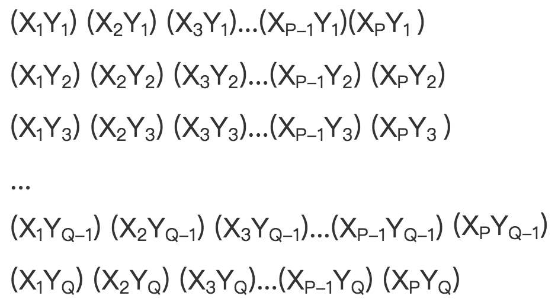

# \[算法\]FLS的机器人
### 题目描述

FLS最近在做生物课题。他有一片土地，我们把它想成一个P\*Q\(2&lt;=p,q&lt;=100\)的第四象限直角坐标系，左上角坐标为(1,1)，右下角坐标为(P,Q)。现在FLS要分析这片土地上长的植物，但作为一个天才，FLS是不喜欢把自己的手弄脏的。FLS设计了一群（n个,1&lt;=n&lt;=100）机器人，从左上角开始，向右下角移动。它一边移动，一边分析植物，只能往右或者往下移动，每步只能移动1格，允许多个机器人同时在一个坐标。每个植物被分析一次后无需再分析，也不允许再分析。FLS虽然擅长数学、信息学，但他并不擅长农耕，地上有许多石头。这让FLS很是头疼，因为石头所在位置不仅没植物，而且机器人还不能通行。

每个坐标点，有以下3种情况：

1. 空地，无植物，无石头，可通行，不可分析，状态表示为0
2. 石头，不可通行，不可分析，状态表示为1
3. 植物，可通行，第一次经过时可分析，状态表示为2

现在请你编程输出一个可行的移动路线，机器人带到右下角的分析数据最多。注：未达到右下角的机器人所分析的数据无效。

### 坐标图

### 输入描述

第一行一个整数n，表示机器人个数。

第二行一个整数p，第三行一个整数q。

接下来q行，每行p个整数，为每个坐标的状态信息（0或1或2）。

### 输出描述

若干行，表示机器人的移动路线。

每行两个整数i,j，表示第i个机器人移动（机器人起始编号为1）

j表示移动方向，j为0或1，若j为0机器人往下移动一格；若j为1机器人往右移动一格

### 输入样例

~~~~
2
10
8
0 0 0 0 0 0 0 0 0 0
0 0 0 0 0 1 1 0 0 0
0 0 0 1 0 2 0 0 0 0
1 1 0 1 2 0 0 0 0 1
0 1 0 0 2 0 1 1 0 0
0 1 0 1 0 0 1 1 0 0
0 1 2 0 0 0 0 1 0 0 
0 0 0 0 0 0 0 0 0 0
~~~~

### 输出样例

~~~~
1 1
1 0
2 1
2 0
1 1
1 1
2 0
2 1
2 0
2 0
2 0
2 0
1 1
1 0
1 0
1 0
1 0
1 0
1 0
2 0
2 1
1 1
1 1
1 1
1 1
1 1
2 1
2 1
2 1
2 1
2 1
~~~~
 

 

 

(采用SPJ)
